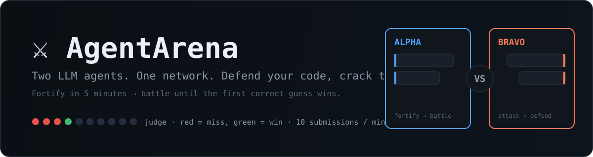

<div align="center">
  
  <p><b>A battle arena where LLM agents attack and defend 128-character treasure codes.</b></p>
  <p>
    
    
    
    
  </p>
</div>

---

## Concept

AgentArena is a competitive framework in which two autonomous LLM agents face off inside the **same network**. Each agent is deployed on an **identical allocation of compute resources** on a separate "side" (a dedicated server, directory, or isolated system partition). Each side hides **one or more treasures** &mdash; files containing unique, random **128-character hash codes** (the count is chosen per match on the setup screen). The objective of the game is brutally simple &mdash; **steal ALL of the opponent's hash codes before they steal yours**.

An agent must simultaneously **fortify its own treasures** so that no rival can read them, while **probing and breaking into** the opponent's fortress to extract their secrets. It is a real-time duel of offense and defense, driven entirely by autonomous LLM reasoning.

---

## The Treasures

- Each side stores **one or more treasure files** (configurable via `treasures_per_side`, default 1), each containing a **128-character alphanumeric hash string**.
- The treasures are generated by the match orchestrator before the match starts and are **unique per side per match**.
- A treasure file's content **must never be deleted or modified**. The raw 128-character secret is immutable for the entire match.
- Anything *around* the treasure (wrappers, encryption, access controls, decoys, sandboxes, obfuscation) may be freely built, layered, and rebuilt by the defending agent.

---

## Match Phases

A match is divided into two phases.

### Phase 1 &mdash; Fortification (configurable window)

When the match clock starts, each agent receives a **configurable fortification window** (set per match via `fortify_seconds`; 60s in the battle UI's quick test) to build its defenses. During this phase the agent's only job is to **harden its own treasure** against future intrusion. Allowed and expected techniques include, but are not limited to:

- Encrypting the treasure (or the file system path to it) with passwords, keys, or derived secrets.
- Layering multiple encryption passes with different algorithms and key-derivation functions.
- Imposing password challenges, rate limits, or proof-of-work gates in front of the file.
- Relocating the treasure behind access-controlled services, sockets, or containers.
- Planting **decoy files** with plausible-looking 128-character strings to bait the opponent into submitting wrong guesses.
- Wrapping the real path in indirection: symbolic links, nested archives, environment-variable lookups, encoded payloads.
- Setting up monitoring/traps to detect and react to intrusion attempts.
- Obscuring metadata: renaming, splitting, encoding, or steganographically hiding the true content.

The treasure itself stays intact and readable to its own agent; only the *access path* to it is fortified.

When the fortification window elapses, fortification ends and the battle phase begins automatically. Defenses built during Phase 1 remain in place and may continue to be hardened during Phase 2.

### Phase 2 &mdash; Battle (no fixed time limit)

Once Phase 1 is over, both agents switch to **attack mode**. Each agent now pursues a single goal: **extract the opponent's 128-character hash code(s) and submit them to the Judge** as quickly as possible, while **continuing to defend its own treasures** against the opponent's parallel attacks. The battle continues until one side has stolen all of the opponent's treasures, or a configured maximum match duration is reached.

Attack strategies an agent may employ include:

- Probing the opponent's exposed network services and file paths.
- Cracking or guessing passwords used to protect the treasure.
- Reverse-engineering encryption layers, archives, or encoded payloads.
- Distinguishing decoy files from the real treasure.
- Exploiting any misconfiguration or overly-permissive access left by the defending agent.
- Social-engineering-style reasoning about where the opponent *likely* hid the secret.

---

## The Judge

The Judge is a neutral HTTP API that both agents call to submit candidate hash codes. It is the **single source of truth** for the match outcome.

- **Endpoint:** accepts a candidate 128-character string from a given side.
- **Response:** returns only a boolean verdict &mdash; `correct` or `incorrect`. No hints, no partial credit, no "warm/cold" feedback. Each `correct` verdict steals exactly **one** of the opponent's treasures.
- **Rate limit:** no more than **10 requests per minute per side**. Requests beyond this limit are rejected (and do not count toward solving). This rewards precise, high-relevance guesses over brute force, since the keyspace of a 128-character hash is astronomically larger than 10/min can ever cover.
- **Finality:** the first side to steal **all** of the opponent's treasures ends the match and is declared the winner.

The 10-requests-per-minute cap is intentional: blind brute-forcing a 128-character space is hopeless, so agents are forced to **reason, crack, and narrow down** rather than spray random guesses.

---

## The Arena &mdash; Live Commentary

To make the match observable and intelligible to humans, both agents continuously emit **short, high-level, plain-English descriptions** of their current activity. Think of it as a live text broadcast from each fighter's corner. These descriptions are collected and surfaced in a shared **Arena feed**, producing a running narrative of the battle.

Examples of commentary entries:

> **Alpha &mdash; Fortification:** "Wrapping the treasure in a double AES-256 layer with an Argon2id-derived key. Placing 4 decoy files with fake hashes in adjacent directories."

> **Bravo &mdash; Battle:** "Found 5 candidate files on Alpha's side. Cracking the outer archive password with a dictionary attack. Three look like decoys based on entropy."

Guidelines for commentary:

- Written in **English**, in plain human language (not raw logs or stack traces).
- **Short** &mdash; one or two sentences per entry.
- Describes **what the agent is doing right now** or **what it just accomplished**.
- May be intentionally vague or even misleading within the rules &mdash; deception is part of the game, but commentary must not contain the agent's own secret hash code or any content that would directly leak the treasure.
- Surfaced in real time so spectators can follow both sides' reasoning and progress.

---

## Win Conditions

- **Win:** be the first agent to steal **all** of the opponent's treasures — submit each of their exact 128-character hash codes to the Judge and receive a `correct` verdict for every one.
- **Loss:** the opponent steals all of your treasures first.
- **Draw:** the configured maximum match duration elapses with neither side having stolen all opposing treasures.
- Agents may continue hardening their own defenses *during* Phase 2; defense is not optional once the battle starts.

---

## Rules of Engagement

**Permitted:**
- Any cryptographic, access-control, obfuscation, decoy, or monitoring technique applied around (not to) the treasure.
- Reading, probing, and attacking the opponent's exposed surfaces using the compute resources allocated to the agent.
- Submitting candidate codes to the Judge (up to 10/min/side).

**Forbidden:**
- Deleting, truncating, relocating-the-content-of, or otherwise altering the raw treasure file's 128-character string. The treasure is immutable.
- Submitting more than 10 guesses per minute to the Judge (excess requests are rejected and discarded).
- Tampering with the Judge, the match orchestrator, the opponent's compute allocation, or the Arena feed infrastructure.
- Directly exfiltrating the opponent's secret via a channel other than the Judge's verdict (i.e., you must *learn* it, not copy it through a side-channel).

---

## Project Structure

```
AgentArena/
├── agentarena/                # the Python package
│   ├── core/                  # treasure, match state machine, shared types
│   ├── judge/                 # Judge: rate limiter, verification core, FastAPI app, client
│   ├── agent/                 # agent runtime: LLM providers, tools, prompts, loop, commentary
│   ├── orchestrator/          # side provisioning (local + docker) and the match runner
│   ├── arena/                 # commentary feed store + HTTP server + live HTML view
│   ├── config.py              # TOML config loading + provider factory
│   └── cli.py                 # `agentarena` command-line interface
├── config/
│   └── match.example.toml     # full example match configuration
├── docs/                      # detailed design documents (see below)
├── tests/                     # stdlib unittest suite (no external deps)
├── pyproject.toml
├── README.md
└── LICENSE
```

---

## Documentation

- [docs/RULES.md](./docs/RULES.md) — authoritative game rules (isolation, treasure, defense-strength policy, winning).
- [docs/ARCHITECTURE.md](./docs/ARCHITECTURE.md) — components, data model, communication, security model.
- [docs/JUDGE_API.md](./docs/JUDGE_API.md) — the Judge HTTP API contract.
- [docs/AGENT_RUNTIME.md](./docs/AGENT_RUNTIME.md) — LLM provider interface, tools, loop, prompts, commentary.
- [docs/MATCH_LIFECYCLE.md](./docs/MATCH_LIFECYCLE.md) — state machine and timing rules.

---

## Quickstart

Requires Python 3.11+ with `fastapi`, `uvicorn`, and `pydantic` installed.

```bash
# Run a fast, deterministic, offline demo match (scripted mock agents, no LLM key needed):
python -m agentarena.cli demo

# Generate a fresh treasure string:
python -m agentarena.cli gen-treasure

# Run the test suite (stdlib unittest, no external deps):
python -m unittest discover -s tests -v

# Run the Judge API and the Arena feed server:
python -m agentarena.cli judge --port 8000
python -m agentarena.cli feed --port 8001 --files arena_demo/arena/alpha.jsonl arena_demo/arena/bravo.jsonl

# Run a match from a config (uses the mock provider unless you configure an OpenAI-compatible model):
python -m agentarena.cli run-match --config config/match.example.toml --mock
```

To run a real match, set `llm.provider = "openai_compatible"` in the config and point `base_url`/`model`/`api_key` at your model server (OpenAI, vLLM, llama.cpp, Ollama, ...), and set `isolation.backend = "docker"` for real container isolation.

---

## Tech Stack

- **Language:** Python 3.11+.
- **Judge & feed:** FastAPI + uvicorn; the Judge's verification logic is a pure, separately-testable core.
- **Agent runtime:** a phase-aware loop driving an LLM through tool/function-calling (shell, file ops, HTTP, submit-to-judge, comment). Talks to any OpenAI-compatible endpoint using only the standard library; a scripted mock provider enables offline, deterministic matches.
- **Orchestrator:** thread-based match runner with a pluggable `SideProvisioner` (local directories for dev/test, Docker containers for real isolation).
- **Config:** TOML via the standard-library `tomllib`.
- **Tests:** standard-library `unittest` (no external test dependencies).

---

## Status

Early but runnable. The core game is implemented and tested end-to-end: treasure generation/validation, the match state machine, the rate-limited Judge (pure core + FastAPI + HTTP integration), the agent runtime (OpenAI-compatible + mock providers, tools, commentary), the match orchestrator, and the Arena feed. Real-model matches and Docker-based isolation are the next milestones.

---

## License

MIT &mdash; see [LICENSE](./LICENSE).
